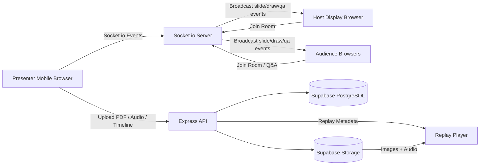

# PRD — SyncSlide

> **해커톤 및 MVP 최적화 실시간 프레젠테이션 동기화 서비스**  
> Version: v1.0  
> 목적: 단기간 안에 핵심 가치를 증명할 수 있는 실시간 발표 공유·리플레이 MVP 정의

---

## 1. 서비스 개요

**SyncSlide**는 발표자의 모바일 브라우저를 리모컨처럼 사용해 대형 스크린과 청중 화면을 실시간으로 동기화하는 웹 기반 프레젠테이션 서비스입니다.

기존 발표 녹화 방식처럼 발표 화면 전체를 동영상으로 인코딩하지 않고, 다음 세 가지 데이터를 조합해 발표를 재현합니다.

1. 고해상도 슬라이드 이미지
2. 모바일 마이크 오디오 녹음
3. 밀리초 단위 이벤트 타임라인 로그

이를 통해 무거운 비디오 인코딩 서버 없이도 원본 해상도에 가까운 리플레이를 제공하고, 해커톤·데모데이·MVP 발표 환경에서 빠르게 사용할 수 있는 발표 공유 경험을 제공합니다.

---

## 2. 문제 정의

해커톤이나 데모데이 발표 환경에서는 다음 문제가 자주 발생합니다.

- 발표자 노트북, 포인터, 케이블, 대형 스크린 연결이 매번 번거롭다.
- 청중은 발표 자료를 실시간으로 보기 어렵고, 질문 제출도 분산된다.
- 발표 녹화본을 만들려면 화면 녹화, 영상 인코딩, 업로드 과정이 무겁다.
- 짧은 MVP 개발 기간 안에 실시간 발표·녹화·리플레이 기능을 모두 구현하기 어렵다.

SyncSlide는 발표 화면을 영상이 아니라 **슬라이드 이미지와 이벤트 로그의 조합**으로 다루어, 실시간성과 리플레이 비용 문제를 동시에 해결합니다.

---

## 3. 제품 목표와 비목표

### 3.1. 제품 목표

- 발표자가 모바일 하나로 슬라이드 전환, 판서, 레이저 포인터, Q&A 선택을 제어한다.
- 대형 스크린과 청중 화면은 발표자 조작에 맞춰 실시간으로 강제 동기화된다.
- 발표 종료 후 오디오와 이벤트 타임라인을 저장해 리플레이를 재생할 수 있다.
- 해커톤 환경에서 빠르게 개발·배포 가능한 구조를 우선한다.

### 3.2. 비목표

MVP 단계에서는 다음 기능을 제외합니다.

- PPTX 원본 편집 기능
- 실시간 영상 스트리밍
- 발표자 얼굴 녹화
- 다중 발표자 동시 제어
- 오프라인 모드
- 정교한 권한 관리 콘솔
- 엔터프라이즈급 감사 로그

---

## 4. 핵심 가치

### 4.1. Zero Configuration

복잡한 포인터 기기나 케이블 연결 없이, 발표자는 로그인된 모바일 브라우저에서 **리모컨 시작** 버튼만 누르면 대형 스크린 및 청중 화면과 즉시 페어링됩니다.

### 4.2. Ultra Low Latency

Socket.io 기반의 경량 이벤트 전송으로 슬라이드 전환, 판서, 레이저 포인터 좌표가 실시간에 가깝게 동기화됩니다.

### 4.3. Cost-Effective Replay

전체 화면을 비디오로 인코딩하지 않고, 오디오 파일과 이벤트 타임라인 JSON을 저장합니다. 리플레이 시점에는 오디오 시간에 맞춰 슬라이드와 판서 이벤트를 재생하므로 서버 비용을 크게 줄일 수 있습니다.

---

## 5. 사용자 역할 및 권한

| 역할 | 사용 환경 | 주요 권한 | 제약 조건 |
| --- | --- | --- | --- |
| 발표자 | 로그인된 모바일 브라우저 | PDF 업로드, 발표장 생성, 리모컨 시작, 슬라이드 제어, 판서, 레이저 포인터, 오디오 녹음, Q&A 선택, 발표 저장 | 슬라이드 소유자만 발표자 권한 획득 가능 |
| 공연장 스크린 | 대형 화면에 연결된 PC 브라우저 | 발표장 링크 진입, 청중 QR 대기화면 출력, 발표 화면 렌더링 | 자체 입력·제어 불가 |
| 청중 | QR을 스캔한 모바일/PC 브라우저 | 로그인 없이 세션 입장, 발표 화면 실시간 시청, Q&A 제출 | 개별 슬라이드 넘김 불가, 발표자 모드 진입 불가 |

---

## 6. MVP 범위

### 6.1. 반드시 구현할 기능

- 이메일/비밀번호 로그인
- PDF 업로드
- PDF 페이지별 이미지 변환
- 발표 자료 보관함
- 발표장 링크 생성
- 청중 입장용 QR 대기화면
- 발표자 모바일 리모컨
- 실시간 슬라이드 동기화
- 실시간 Canvas 판서
- 레이저 포인터
- 청중 Q&A 제출
- 발표자 Q&A 선택 및 화면 강조
- 모바일 마이크 오디오 녹음
- 이벤트 타임라인 저장
- 리플레이 재생

### 6.2. 해커톤 데모에서 강조할 기능

1. PC 화면은 QR 대기화면으로 시작한다.
2. 청중은 QR만 찍고 즉시 들어온다.
3. 발표자가 모바일에서 리모컨 시작을 누르면 모든 화면이 첫 슬라이드로 동시에 전환된다.
4. 모바일에서 스와이프하면 대형 스크린과 청중 화면이 즉시 따라온다.
5. 발표자가 그린 판서와 레이저 포인터가 모든 화면에 동기화된다.
6. 청중 질문을 발표자가 선택하면 모든 화면에 질문 팝업이 뜬다.
7. 발표 저장 후 녹화 영상 없이도 리플레이가 재생된다.

---

## 7. 핵심 사용자 흐름

## 7.1. 자료 업로드 및 이미지 변환

1. 발표자는 이메일/비밀번호로 로그인한다.
2. 마이페이지에서 PDF 파일을 업로드한다.
3. 백엔드는 PDF를 수신한다.
4. 각 페이지를 `1920x1080` 기준의 WebP 이미지로 변환한다.
5. 변환된 이미지를 Supabase Storage에 저장한다.
6. 이미지 URL 배열을 `Presentation.images`에 저장한다.
7. 발표자는 보관함에서 슬라이드를 넘겨보며 변환 결과를 확인한다.

### 성공 기준

- 20페이지 이하 PDF가 업로드 후 정상적으로 이미지 배열로 변환된다.
- 발표자는 변환된 슬라이드를 브라우저에서 미리 볼 수 있다.
- 변환 실패 시 사용자에게 재시도 가능한 오류 메시지가 표시된다.

---

## 7.2. 발표장 오픈 및 청중 입장

1. 발표자는 PC 브라우저에서 슬라이드 상세 페이지에 접속한다.
2. **발표장 링크**를 눌러 대형 스크린용 페이지를 연다.
3. 공연장 스크린에는 불필요한 UI가 제거된 청중 입장용 QR 대기화면이 표시된다.
4. 청중은 QR을 스캔한다.
5. 청중은 로그인 없이 해당 세션의 청중 뷰어 페이지로 진입한다.
6. 청중 화면은 발표 시작 전까지 대기 상태를 유지한다.

### 성공 기준

- 공연장 스크린은 발표 시작 전 QR 대기화면만 보여준다.
- QR에는 청중 전용 토큰 또는 청중 전용 진입 URL만 포함된다.
- 청중은 발표자 권한을 획득할 수 없다.

---

## 7.3. 발표자 마스터 활성화

1. 발표자는 본인 스마트폰에서 SyncSlide에 로그인한다.
2. 해당 슬라이드 상세 페이지에서 **리모컨 시작** 버튼을 누른다.
3. 시스템은 발표자가 슬라이드 소유자인지 검증한다.
4. 검증 성공 시 해당 세션의 제어 마스터로 등록한다.
5. 세션 상태가 `READY`에서 `ACTIVE`로 변경된다.
6. 공연장 스크린과 모든 청중 화면은 첫 번째 슬라이드로 동시에 전환된다.
7. 모바일 마이크 권한 요청이 표시되고, 승인 시 오디오 녹음이 시작된다.
8. 모바일 화면 꺼짐 방지를 위해 Screen Wake Lock을 요청한다.

### 성공 기준

- 발표자만 세션을 `ACTIVE` 상태로 전환할 수 있다.
- 발표 시작 시 모든 클라이언트가 동일한 페이지 번호를 가진다.
- 마이크 권한이 거부되더라도 발표 제어는 가능해야 한다.
- 마이크 권한 거부 시 녹음 없는 발표로 진행됨을 명확히 표시한다.

---

## 7.4. 실시간 발표 제어

발표자는 모바일 리모컨에서 다음 조작을 수행할 수 있습니다.

| 기능 | 입력 방식 | 동기화 대상 |
| --- | --- | --- |
| 다음/이전 슬라이드 | 좌우 스와이프 또는 버튼 | 공연장 스크린, 청중 화면 |
| 일반 펜 | 터치 드래그 | 공연장 스크린, 청중 화면 |
| 지우개 | 터치 드래그 또는 전체 지우기 | 공연장 스크린, 청중 화면 |
| 레이저 포인터 | 터치 이동 | 공연장 스크린, 청중 화면 |
| Q&A 선택 | 질문 카드 터치 | 공연장 스크린, 청중 화면 |

### 성공 기준

- 슬라이드 전환 이벤트는 300ms 이내 체감 지연을 목표로 한다.
- 판서 좌표는 화면 크기가 달라도 동일한 위치에 표시되어야 한다.
- 레이저 포인터는 1.2초 후 자동으로 사라져야 한다.

---

## 7.5. 청중 Q&A 및 질문 강조

1. 청중은 청중 뷰어 하단의 Q&A 입력창에 질문을 작성한다.
2. 질문은 실시간으로 발표자 모바일의 Q&A 탭에 쌓인다.
3. 발표자는 특정 질문을 선택한다.
4. 선택된 질문은 공연장 스크린과 청중 화면에 팝업 형태로 노출된다.
5. 발표자가 질문 강조를 해제하면 팝업이 사라진다.

### 성공 기준

- 청중은 로그인 없이 질문을 제출할 수 있다.
- 질문은 생성 시각 기준 최신순 또는 오래된순으로 정렬 가능해야 한다.
- 발표자가 선택한 질문만 전체 화면에 강조된다.

---

## 7.6. 발표 저장 및 리플레이 생성

1. 발표자는 모바일에서 **발표 저장**을 누른다.
2. 모바일 로컬 메모리에 기록된 오디오 Blob을 서버에 업로드한다.
3. 발표 중 수집된 이벤트 타임라인 JSON을 함께 업로드한다.
4. 백엔드는 오디오 파일 URL과 타임라인 JSON을 `Recording`에 저장한다.
5. 리플레이 페이지에서는 오디오 `currentTime`을 기준으로 이벤트를 재생한다.

### 성공 기준

- 발표 종료 후 오디오와 이벤트 타임라인이 하나의 리플레이 자산으로 저장된다.
- 리플레이에서는 슬라이드 전환, 판서, 레이저 포인터, Q&A 강조가 발표 당시 순서대로 재현된다.
- 영상 인코딩 없이도 발표를 재생할 수 있다.

---

## 8. 화면 구성

## 8.1. 발표자 웹

### 로그인 페이지

- 이메일 입력
- 비밀번호 입력
- 로그인 버튼
- 회원가입 또는 테스트 계정 안내

### 마이페이지 / 보관함

- 업로드된 발표 자료 목록
- 새 PDF 업로드 버튼
- 각 발표 자료의 상태 표시
  - 변환 중
  - 변환 완료
  - 변환 실패
- 발표 자료 상세 진입

### 발표 자료 상세 페이지

- 슬라이드 미리보기
- 발표장 링크 열기
- 모바일 리모컨 시작
- 리플레이 목록

### 모바일 리모컨 화면

> 가로 모드 기준 4-모드(슬라이드 / 스크립트 / 레이저 / 판서) 상세 인터랙션은 `docs/REMOTE_MOBILE_UX.md` 참조.

- 현재 페이지 번호
- 다음/이전 버튼
- 스와이프 영역
- 펜/지우개/레이저 도구 선택
- 스크립트(자막) 모드 — 현재 페이지의 발표 스크립트를 발표자에게만 표시 (§11.4)
- Q&A 탭
- 발표 저장 버튼
- 녹음 상태 표시
- 연결 상태 표시

---

## 8.2. 공연장 스크린

### QR 대기화면

- 발표 제목
- 청중 입장 QR 코드
- 짧은 안내 문구
- 발표 시작 대기 상태 표시

### 발표 화면

- 전체 화면 슬라이드 이미지
- 판서 Canvas 오버레이
- 레이저 포인터 오버레이
- Q&A 강조 팝업
- 불필요한 UI 제거

---

## 8.3. 청중 화면

### 대기 화면

- 발표 제목
- 발표 시작 대기 안내

### 발표 시청 화면

- 현재 슬라이드 이미지
- 판서 오버레이
- Q&A 입력창
- 질문 제출 버튼
- 선택된 질문 팝업

---

## 9. 기술 아키텍처

## 9.1. 기술 스택

| 영역 | 기술 | 선정 이유 |
| --- | --- | --- |
| 프론트엔드 | Next.js App Router | 빠른 MVP 개발, Vercel 배포 용이 |
| 스타일링 | Tailwind CSS | 빠른 UI 구현 |
| 상태 관리 | Zustand | 보일러플레이트가 적고 Canvas/세션 상태 관리에 적합 |
| 백엔드 API | Node.js + Express | 구현 속도와 Socket.io 연동 용이 |
| 실시간 통신 | Socket.io | 재연결, 룸, 브로드캐스트 처리 용이 |
| DB | Supabase PostgreSQL | 관리형 DB, 빠른 초기 구축 |
| 파일 스토리지 | Supabase Storage | PDF, 이미지, 오디오 파일 저장 |
| ORM | Prisma | 타입 안정성과 빠른 스키마 관리 |
| 프론트 배포 | Vercel | Next.js 배포 최적화 |
| 백엔드 배포 | Railway 또는 Render | 웹소켓 서버 배포 용이 |

---

## 9.2. 시스템 구성



---

## 10. PDF 변환 정책

### 10.1. 입력

- 지원 파일: PDF
- MVP 권장 제한: 20페이지 이하
- 파일 크기 제한: 50MB 이하

### 10.2. 변환 결과

- 이미지 포맷: WebP
- 기준 해상도: `1920x1080`
- 비율: 원본 슬라이드 비율 유지
- 저장 위치: Supabase Storage
- DB 저장 값: 페이지 순서대로 정렬된 이미지 URL 배열

### 10.3. 실패 처리

- 변환 실패 시 `Presentation` 상태를 실패로 표시한다.
- 사용자에게 재업로드 또는 재변환 버튼을 제공한다.
- 일부 페이지만 실패하는 경우 MVP에서는 전체 실패로 처리한다.

---

## 11. 판서 및 Canvas 정책

## 11.1. 지원 도구

| 도구 | 설명 |
| --- | --- |
| 일반 펜 | 발표자가 손가락으로 그린 선을 모든 화면에 표시 |
| 지우개 | 특정 선 또는 영역 삭제. MVP에서는 전체 지우기 우선 가능 |
| 레이저 포인터 | 터치 궤적을 일시적으로 표시하고 자동 페이드아웃 |
| 전체 지우기 | 현재 페이지의 모든 판서 삭제 |

## 11.2. 좌표 정규화

디바이스별 화면 크기가 다르기 때문에 절대 픽셀 좌표를 사용하지 않습니다. 모든 판서 좌표는 다음 범위의 상대 좌표로 저장·전송합니다.

```txt
x: 0.0000 ~ 1.0000
y: 0.0000 ~ 1.0000
```

렌더링 시 각 클라이언트는 자신의 Canvas 크기를 기준으로 다음과 같이 실제 좌표를 계산합니다.

```txt
renderX = normalizedX * canvasWidth
renderY = normalizedY * canvasHeight
```

## 11.3. 레이저 포인터 정책

- 레이저 포인터 이벤트는 영구 판서로 저장하지 않는다.
- 리플레이 재현을 위해 타임라인에는 저장할 수 있다.
- 화면에서는 1.2초 후 자동으로 투명해지며 사라진다.

## 11.4. 발표자 스크립트(자막) 정책

발표자가 발표 중 참고할 수 있는 페이지별 스크립트(자막)다. 발표자 리모컨의 **스크립트 모드**에서만 노출된다.

- **저장 위치**: `Presentation.scripts: String[]` — `images`와 동일한 순서·길이(페이지 i의 스크립트 = `scripts[i]`). 비어 있으면 해당 페이지는 스크립트 없음으로 처리한다.
- **노출 범위**: **발표자 리모컨 전용**. 공연장 스크린·청중 화면에는 절대 노출하지 않으며, Socket 이벤트로 브로드캐스트하지 않는다.
- **리플레이**: 스크립트는 타임라인 이벤트가 아니다. 리플레이 재현 대상에서 제외한다.
- **데이터 출처(MVP)**: 1차 MVP에서는 스크립트 입력/편집 UI 및 PDF 텍스트 자동 추출은 비목표다. `scripts` 배열을 채우는 작성 경로는 후속 과제로 두고, 미입력 시 리모컨은 "스크립트 없음"을 표시한다.
- **상세 인터랙션**: `docs/REMOTE_MOBILE_UX.md §3.2` 참조.

---

## 12. 모바일 녹음 정책

### 12.1. 기본 방식

- 발표자 모바일 브라우저에서 `MediaRecorder API`를 사용한다.
- 녹음은 발표 시작 시점과 함께 시작한다.
- 발표 종료 전까지 로컬 메모리에 Blob 형태로 유지한다.
- 발표 저장 시 서버에 업로드한다.

### 12.2. 권한 처리

| 상황 | 처리 |
| --- | --- |
| 마이크 권한 승인 | 오디오 녹음 시작 |
| 마이크 권한 거부 | 녹음 없이 발표 진행 |
| 녹음 중 오류 | 발표 제어는 유지하고 녹음 실패 상태 표시 |
| 업로드 실패 | 재시도 버튼 제공 |

### 12.3. 화면 꺼짐 방지

발표자 모드 진입 시 다음 API를 호출합니다.

```ts
await navigator.wakeLock.request('screen');
```

지원하지 않는 브라우저에서는 경고 메시지를 표시하되 발표 진행은 허용합니다.

---

## 13. 실시간 세션 상태 관리

## 13.1. 서버 인메모리 세션 상태

Socket.io 서버는 각 세션 룸에 대해 최소한 다음 상태를 메모리에 유지합니다.

```ts
type LiveSessionState = {
  sessionId: string;
  presentationId: string;
  status: 'READY' | 'ACTIVE' | 'FINISHED';
  presenterSocketId?: string;
  currentPage: number;
  drawingsByPage: Record<number, DrawEvent[]>;
  highlightedQuestionId?: string;
  startedAt?: number;
};
```

## 13.2. 재연결 처리

클라이언트가 재연결되면 서버는 다음 데이터를 즉시 전송합니다.

- 현재 세션 상태
- 현재 페이지 번호
- 현재 페이지의 누적 판서 목록
- 현재 강조 중인 질문

이를 통해 데모 현장의 일시적인 와이파이 단절에도 화면 상태를 복구할 수 있습니다.

---

## 14. 데이터베이스 모델

## 14.1. Prisma Schema

```prisma
datasource db {
  provider = "postgresql"
  url      = env("DATABASE_URL") // Supabase Connection String
}

generator client {
  provider = "prisma-client-js"
}

model User {
  id            String         @id @default(uuid())
  email         String         @unique
  createdAt     DateTime       @default(now())
  presentations Presentation[]
}

model Presentation {
  id        String   @id @default(uuid())
  title     String
  ownerId   String
  owner     User     @relation(fields: [ownerId], references: [id], onDelete: Cascade)
  pdfUrl    String
  images    String[]
  scripts   String[] // 페이지별 발표 스크립트(자막). images와 동일 순서/길이. 발표자 리모컨 전용. (§11.4)
  status    PresentationStatus @default(PROCESSING)
  createdAt DateTime @default(now())
  updatedAt DateTime @updatedAt
  sessions  Session[]
}

enum PresentationStatus {
  PROCESSING
  READY
  FAILED
}

model Session {
  id             String        @id @default(uuid())
  presentationId String
  presentation   Presentation  @relation(fields: [presentationId], references: [id], onDelete: Cascade)
  status         SessionStatus @default(READY)
  createdAt      DateTime      @default(now())
  startedAt      DateTime?
  endedAt        DateTime?
  questions      Question[]
  recording      Recording?
}

enum SessionStatus {
  READY
  ACTIVE
  FINISHED
}

model Question {
  id        String   @id @default(uuid())
  sessionId String
  session   Session  @relation(fields: [sessionId], references: [id], onDelete: Cascade)
  nickname  String?
  content   String
  createdAt DateTime @default(now())
}

model Recording {
  id        String   @id @default(uuid())
  sessionId String   @unique
  session   Session  @relation(fields: [sessionId], references: [id], onDelete: Cascade)
  audioUrl  String?
  timeline  Json
  createdAt DateTime @default(now())
}
```

---

## 15. 이벤트 타임라인 규격

리플레이는 오디오 플레이어의 `currentTime`을 밀리초 단위로 환산한 뒤, 해당 시점까지의 이벤트를 순차 적용하여 화면을 복원합니다.

```json
[
  { "t": 0, "type": "SESSION_START" },
  { "t": 1200, "type": "SLIDE_CHANGE", "page": 1 },
  { "t": 3500, "type": "DRAW_START", "color": "#FF3B30", "thickness": 4 },
  { "t": 3610, "type": "DRAW_MOVE", "x": 0.1245, "y": 0.3241 },
  { "t": 3650, "type": "DRAW_MOVE", "x": 0.1289, "y": 0.3312 },
  { "t": 3900, "type": "DRAW_END" },
  { "t": 8400, "type": "LASER_POINTER", "x": 0.5412, "y": 0.7214 },
  { "t": 15000, "type": "SLIDE_CHANGE", "page": 2 },
  { "t": 42000, "type": "QA_SELECT", "questionId": "q-demo-102" },
  { "t": 55000, "type": "SESSION_END" }
]
```

## 15.1. 이벤트 타입

| 타입 | 설명 | 주요 필드 |
| --- | --- | --- |
| `SESSION_START` | 발표 시작 | `t` |
| `SLIDE_CHANGE` | 슬라이드 전환 | `page` |
| `DRAW_START` | 판서 시작 | `color`, `thickness` |
| `DRAW_MOVE` | 판서 이동 좌표 | `x`, `y` |
| `DRAW_END` | 판서 종료 | 없음 |
| `DRAW_CLEAR` | 현재 페이지 판서 전체 삭제 | `page` |
| `LASER_POINTER` | 레이저 포인터 위치 | `x`, `y` |
| `QA_SELECT` | 질문 강조 | `questionId` |
| `QA_HIDE` | 질문 강조 해제 | 없음 |
| `SESSION_END` | 발표 종료 | `t` |

---

## 16. Socket.io 이벤트 프로토콜

## 16.1. `join_room`

**방향:** Client → Server

```ts
type JoinRoomPayload = {
  sessionId: string;
  role: 'presenter' | 'display' | 'audience';
  token?: string;
};
```

**설명**

- 세션 룸에 입장한다.
- `presenter` 역할은 토큰 또는 로그인 세션 검증이 필요하다.
- `display`, `audience`는 제어 권한이 없다.

---

## 16.2. `session_state`

**방향:** Server → Client

```ts
type SessionStatePayload = {
  status: 'READY' | 'ACTIVE' | 'FINISHED';
  currentPage: number;
  drawings: DrawEvent[];
  highlightedQuestionId?: string;
};
```

**설명**

- 최초 입장 또는 재연결 시 현재 상태를 전달한다.

---

## 16.3. `presenter_activate`

**방향:** Presenter → Server → Display/Audience

```ts
type PresenterActivatePayload = {
  sessionId: string;
};
```

**설명**

- 발표자가 리모컨 시작을 누를 때 발생한다.
- 서버 검증 후 세션을 `ACTIVE` 상태로 변경한다.
- 모든 클라이언트를 첫 번째 슬라이드로 전환한다.

---

## 16.4. `slide_change`

**방향:** Presenter → Server → Display/Audience

```ts
type SlideChangePayload = {
  page: number;
};
```

**설명**

- 발표자가 페이지를 전환하면 룸 내 모든 디스플레이와 청중의 슬라이드를 강제 이동한다.
- 타임라인에 `SLIDE_CHANGE` 이벤트로 저장한다.

---

## 16.5. `draw_event`

**방향:** Presenter → Server → Display/Audience

```ts
type DrawEventPayload = {
  type: 'start' | 'move' | 'end' | 'clear' | 'laser';
  page: number;
  x?: number;
  y?: number;
  color?: string;
  thickness?: number;
};
```

**설명**

- Canvas 판서 및 레이저 포인터 이벤트를 상대 좌표 기반으로 전송한다.
- `start`, `move`, `end`, `clear`는 필요 시 타임라인에 저장한다.
- `laser`는 리플레이 지원 여부에 따라 저장하거나 실시간 표시만 할 수 있다.

---

## 16.6. `question_submit`

**방향:** Audience → Server → Presenter

```ts
type QuestionSubmitPayload = {
  sessionId: string;
  nickname?: string;
  content: string;
};
```

**설명**

- 청중이 질문을 제출한다.
- 서버는 DB에 질문을 저장하고 발표자에게 실시간 전달한다.

---

## 16.7. `qa_highlight`

**방향:** Presenter → Server → Display/Audience

```ts
type QaHighlightPayload = {
  questionId: string;
  isVisible: boolean;
};
```

**설명**

- 발표자가 선택한 질문을 스크린과 청중 화면에 강조 팝업으로 노출하거나 해제한다.
- 타임라인에는 `QA_SELECT` 또는 `QA_HIDE` 이벤트로 저장한다.

---

## 16.8. `presentation_end`

**방향:** Presenter → Server → Display/Audience

```ts
type PresentationEndPayload = {
  sessionId: string;
};
```

**설명**

- 발표자가 발표 종료를 누를 때 발생한다.
- 세션 상태를 `FINISHED`로 변경한다.
- 이후 오디오와 타임라인 업로드를 진행한다.

---

## 17. REST API 초안

| Method | Endpoint | 설명 |
| --- | --- | --- |
| `POST` | `/api/auth/login` | 로그인 |
| `POST` | `/api/presentations` | PDF 업로드 및 변환 요청 |
| `GET` | `/api/presentations` | 내 발표 자료 목록 조회 |
| `GET` | `/api/presentations/:id` | 발표 자료 상세 조회 |
| `POST` | `/api/presentations/:id/sessions` | 발표 세션 생성 |
| `GET` | `/api/sessions/:id` | 세션 정보 조회 |
| `POST` | `/api/sessions/:id/recording` | 오디오 및 타임라인 저장 |
| `GET` | `/api/recordings/:id` | 리플레이 데이터 조회 |

---

## 18. 보안 정책

### 18.1. 역할 분리

- QR로 입장하는 사용자는 항상 `audience` 역할만 가진다.
- 발표자 권한은 로그인 세션과 슬라이드 소유권으로 검증한다.
- 공연장 스크린은 `display` 역할이며 입력 권한이 없다.

### 18.2. 세션 토큰

- 청중 QR에는 세션 ID와 청중 전용 토큰만 포함한다.
- 발표자 제어 토큰은 QR에 포함하지 않는다.
- 발표자 활성화 요청은 서버에서 반드시 소유권을 검증한다.

### 18.3. Q&A 보호

- MVP에서는 로그인 없는 Q&A를 허용한다.
- 질문 길이는 제한한다.
- 동일 클라이언트의 과도한 연속 제출은 rate limit을 적용한다.

---

## 19. 리플레이 플레이어 정책

### 19.1. 재생 방식

1. 리플레이 페이지에서 슬라이드 이미지 URL 배열을 로드한다.
2. 오디오 파일을 로드한다.
3. 타임라인 JSON을 로드한다.
4. 오디오 `currentTime` 변화에 따라 해당 시점까지의 이벤트를 적용한다.
5. 사용자가 seek하면 화면 상태를 해당 시점 기준으로 재계산한다.

### 19.2. Seek 처리

단순 선형 탐색은 구현이 쉽지만 긴 발표에서는 느려질 수 있습니다. MVP에서는 다음 방식 중 하나를 사용합니다.

- 1차 MVP: 처음부터 해당 시점까지 이벤트를 재적용
- 개선안: 슬라이드 변경 이벤트 기준으로 인덱스를 만들고 가장 가까운 체크포인트부터 재적용

---

## 20. 비기능 요구사항

| 항목 | 목표 |
| --- | --- |
| 슬라이드 전환 지연 | 체감 300ms 이내 |
| 판서 이벤트 지연 | 체감 300ms 이내 |
| PDF 페이지 수 | MVP 기준 20페이지 이하 권장 |
| 브라우저 | 최신 Chrome, Safari 우선 지원 |
| 모바일 | iOS Safari, Android Chrome 우선 지원 |
| 동시 접속 | 해커톤 데모 기준 30명 내외 청중 |
| 저장 비용 | 비디오 인코딩 없이 이미지·오디오·JSON 중심 저장 |

---

## 21. 에러 및 예외 처리

| 상황 | 처리 방식 |
| --- | --- |
| PDF 업로드 실패 | 오류 메시지 및 재업로드 버튼 표시 |
| PDF 변환 실패 | 상태를 `FAILED`로 표시하고 재시도 제공 |
| 발표자 소켓 끊김 | 재연결 시 기존 세션 상태 복구 |
| 청중 소켓 끊김 | 재연결 시 현재 페이지와 판서 상태 복구 |
| 마이크 권한 거부 | 녹음 없이 발표 진행 |
| 오디오 업로드 실패 | 발표 종료 후 재업로드 버튼 제공 |
| 백엔드 서버 재시작 | MVP에서는 세션 상태 유실 가능. 발표 재시작 안내 |

---

## 22. 개발 우선순위

### Phase 1 — 발표 동기화 핵심

- PDF 업로드
- 이미지 변환
- 발표장 생성
- QR 대기화면
- 발표자 리모컨
- 슬라이드 실시간 동기화

### Phase 2 — 상호작용

- Canvas 판서
- 레이저 포인터
- 청중 Q&A
- 질문 강조 팝업

### Phase 3 — 리플레이

- 모바일 오디오 녹음
- 이벤트 타임라인 수집
- 발표 저장
- 리플레이 플레이어

### Phase 4 — 데모 안정화

- 재연결 복구
- 화면 꺼짐 방지
- 오류 메시지 정리
- 배포 환경 고정
- 테스트 발표 시나리오 준비

---

## 23. 해커톤 데모 시나리오

1. 발표자가 PC에서 발표장 링크를 연다.
2. 대형 스크린에 QR 대기화면이 나온다.
3. 심사위원 또는 청중이 QR로 입장한다.
4. 발표자가 스마트폰에서 리모컨 시작을 누른다.
5. 모든 화면이 첫 번째 슬라이드로 전환된다.
6. 발표자가 모바일에서 슬라이드를 넘긴다.
7. 발표자가 판서와 레이저 포인터를 사용한다.
8. 청중이 질문을 제출한다.
9. 발표자가 질문을 선택하고, 모든 화면에 질문 팝업이 표시된다.
10. 발표자가 발표 저장을 누른다.
11. 리플레이 페이지에서 발표 당시 흐름이 재생된다.

---

## 24. 수용 기준

MVP 완료 판단 기준은 다음과 같습니다.

- 발표자는 PDF를 업로드하고 슬라이드 이미지로 변환할 수 있다.
- 공연장 스크린은 청중 QR 대기화면을 표시할 수 있다.
- 청중은 QR을 통해 로그인 없이 세션에 입장할 수 있다.
- 발표자 모바일에서 리모컨 시작을 누르면 전체 화면이 발표 상태로 전환된다.
- 발표자의 슬라이드 전환이 공연장 스크린과 청중 화면에 반영된다.
- 발표자의 판서가 공연장 스크린과 청중 화면에 반영된다.
- 청중은 질문을 제출할 수 있다.
- 발표자는 질문을 선택해 전체 화면에 강조할 수 있다.
- 발표 종료 후 오디오와 이벤트 타임라인이 저장된다.
- 리플레이 페이지에서 발표 흐름을 재현할 수 있다.

---

## 25. 핵심 설계 요약

SyncSlide의 본질은 다음과 같습니다.

- 발표 화면을 비디오가 아니라 **상태와 이벤트**로 다룬다.
- 모바일 브라우저를 발표 리모컨으로 사용한다.
- 대형 스크린과 청중 화면은 발표자의 상태를 실시간으로 따라간다.
- 리플레이는 오디오와 이벤트 타임라인을 조합해 저비용으로 재현한다.

해커톤 MVP에서는 완벽한 엔터프라이즈 발표 도구보다, **QR 입장 → 모바일 제어 → 실시간 동기화 → 저장 없는 영상 같은 리플레이**라는 강한 데모 경험을 우선한다.
